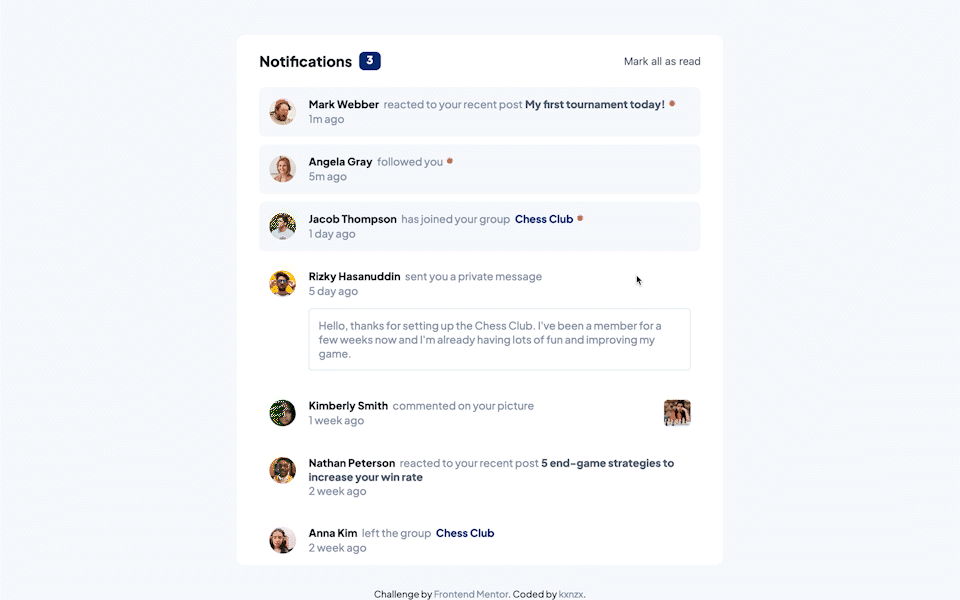

# Frontend Mentor - Notifications page solution

This is a solution to the [Notifications page challenge on Frontend Mentor](https://www.frontendmentor.io/challenges/notifications-page-DqK5QAmKbC). Frontend Mentor challenges help you improve your coding skills by building realistic projects.

## Table of contents

- [Overview](#overview)
  - [The challenge](#the-challenge)
  - [Screenshot](#screenshot)
  - [Links](#links)
- [My process](#my-process)
  - [Built with](#built-with)
  - [What I learned](#what-i-learned)
- [Author](#author)

## Overview

### The challenge

Users should be able to:

- Distinguish between "unread" and "read" notifications
- Select "Mark all as read" to toggle the visual state of the unread notifications and set the number of unread messages to zero
- View the optimal layout for the interface depending on their device's screen size
- See hover and focus states for all interactive elements on the page

### Screenshot

#### Screensize 1440px - Desktop



#### Screensize 375px - Mobile


### Links

- View my Solution on [Frontend Mentor](https://www.frontendmentor.io/solutions/notification-page-made-with-vanilla-javascript-NWnUcen1iP)
- View the [Live Site](https://kxnzx.github.io/notifications-page-main/)

## My process

- HTML semantics
- Set variables
- Reset default settings
- Styles (Mobile First)
- JavaScript

### Built with

- Semantic HTML5 markup
- JavaScript
- SASS custom properties
- CSS Grid
- CSS Flexbox
- Mobile-first workflow
- Static Font File

### What I learned

I have gained some insight about how typography works on the web.

For this challenge I choose to use both Static & Variable Fonts. By doing this I have learned the difference between them.

Static Fonts:
Each width, weight, or style has it's own seperate font file, which requires multiple HTTP requests.

Variable Fonts:
A single file which contains a typeface with a broad range of font variations, such as weights, widths, styles and optical sizes.

Reasons to use Variable Fonts:

- designer has a broad range of fonts variations to choose from
- supports CSS transition and animation
- easy & efficient incorporation for developer
- only one HTTP request, thus optimizes site performance

I am accustomed to make use of Google Fonts with the @import rule. With this rule you import a Google Fonts stylesheet into your stylesheet with an HTTP fetch request. This was my first time using the @font-face rule:

```css
// Variable
@font-face {
  font-family: "PlusJakartaSans-VariableFont";
  src: url("../assets/fonts/PlusJakartaSans-VariableFont_wght.ttf");
  font-weight: 100 1000;
}
// Static
@font-face {
  font-family: "plusJakartaSans-Medium";
  src: url("../assets/fonts/static/PlusJakartaSans-Medium.ttf");
}
```

With the @font-face rule you locally host your fonts. This allows you to download a particular font from your server, to render a webpage if the user hasn't got that font installed on the computer.

Fonts come in different file formats. The most common are:

- OTF = OpenType Font Format
- TTF = TrueType Font Format
- WOFF = Web Open Font Format
- WOFF2

This challenge included Fonts in TrueType Font Format.

## Author

- Frontend Mentor - [@kxnzx](https://www.frontendmentor.io/profile/kxnzx)
